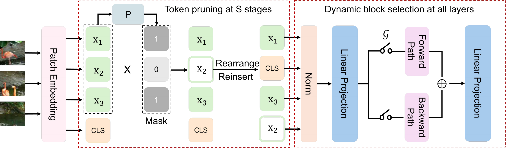

<div align="center">
<h1>Dynamic Vision Mamba</h1>

Mengxuan Wu $^{1*}$, Zekai Li $^{1*\dagger}$, Zhiyuan Liang $^{1*}$, Moyang Li $^{2}$, Xuanlei Zhao $^{1}$, Samir Khaki $^{3}$, Zheng Zhu $^{4}$, Xiaojiang Peng $^{5}$, Konstantinos N. Plataniotis $^{3}$, Kai Wang $^{1\ddagger}$, Wangbo Zhao $^{1\ddagger}$, Yang You $^{1}$

$^{1}$ NUS, $^{2}$ ETH, $^{3}$ University of Toronto, $^{4}$ Tsinghua University, $^{5}$ Shenzhen Technology University

(\*) equal contribution, ($\dagger$) project lead, ($\ddagger$) corresponding author.

<!-- ArXiv Preprint ([arXiv](https://arxiv.org/abs/)) -->
</div>


## News

2025-04-06: We release the code of Dynamic Vision Mamba (DyVM).

## Overview



Mamba-based vision models have gained extensive attention as a result of being computationally more efficient than attention-based models. 
However, spatial redundancy still exists in these models, represented by token and block redundancy.
For token redundancy, we analytically find that early token pruning methods will result in inconsistency between training and inference or introduce extra computation for inference.
Therefore, we customize token pruning to fit the Mamba structure by rearranging the pruned sequence before feeding it into the next Mamba block.
For block redundancy, we allow each image to select SSM blocks dynamically based on an empirical observation that the inference speed of Mamba-based vision models is largely affected by the number of SSM blocks.
Our proposed method, Dynamic Vision Mamba (DyVM), effectively reduces FLOPs with minor performance drops.
We achieve a reduction of 35.2\% FLOPs with only a loss of accuracy of 1.7\% on Vim-S.
It also generalizes well across different Mamba vision model architectures and different vision tasks.

## Environment

We use the same environment as the original Vim codebase.

```bash
# Python 3.10.13
conda create -n dyvm python=3.10.13
conda activate dyvm

# torch 2.1.1 + cu118
pip install torch==2.1.1 torchvision==0.16.1 torchaudio==2.1.1 --index-url https://download.pytorch.org/whl/cu118

# Requirements: vim_requirements.txt
pip install -r vim_requirements.txt

# Install causal_conv1d and mamba
pip install -e causal_conv1d>=1.1.0
pip install -e mamba-1p1p1
```

To be noticed, you must install the of `mamba` under the `mamba-1p1p1` directory, since we have made some modifications to the original `mamba` codebase.

If you cannot install the `mamba` we provided, you can first install the original `mamba` from the [release](https://github.com/state-spaces/mamba/archive/refs/tags/v1.1.1.zip). Then, replace the `mamba-ssm` directory in your conda environment with the `mamba-ssm` directory in the `mamba-1p1p1` directory.

```bash
rm -rf /path/to/your/conda/env/dyvm/lib/python3.10/site-packages/mamba-ssm/
cp -r mamba-1p1p1/mamba-ssm /path/to/your/conda/env/dyvm/lib/python3.10/site-packages/
```

## Quick Start

We provide all training scripts used in our experiments in `vim/scripts/`. Change the `--data-path` to the path of your ImageNet dataset and run the script to train your model. An example is:

```bash
cd vim
bash scripts/vim-t.sh
```

## Evaluation

By adding `--eval` flag in the training script and change the `--model-path` to the path of your trained model, you can evaluate the model directly after training. An example of evaluation script is provided in `vim/scripts/eval.sh`.

```bash
cd vim
bash scripts/eval.sh
```

## Albation Study

We provide the code of each ablation study in the `Albatation` directory. You can follow the scripts in their `vim/scripts/` directory to reproduce the results.

## Model Weights

| Model | #Param. | Top-1 Acc. | Download Link |
| :---: | :---: | :---: | :---: |
| DyVM-Vim-S | 27M | 78.8 | [Google Drive](https://drive.google.com/file/d/1OzSZbY5CP0zoUwYL2JlXCZRrpjkIjsq7/view?usp=drive_link) |
| DyVM-Vim-B | 101M | 79.9 | [Google Drive](https://drive.google.com/file/d/1tpGSsh8lJs-wcjrdexgjzeFgimlzs44P/view?usp=drive_link) |

## Acknowledgement
This project is based on Vim ([paper](https://icml.cc/virtual/2024/poster/33768), [code](https://github.com/hustvl/Vim)), Mamba ([paper](https://arxiv.org/abs/2312.00752), [code](https://github.com/state-spaces/mamba)), Causal-Conv1d ([code](https://github.com/Dao-AILab/causal-conv1d)), DeiT ([paper](https://arxiv.org/abs/2012.12877), [code](https://github.com/facebookresearch/deit)). Thanks for their wonderful works.

## Citation
If you find DyVM is useful in your research or applications, please consider giving us a star 🌟.

<!-- If you find DyVM is useful in your research or applications, please consider giving us a star 🌟 and citing it by the following BibTeX entry. -->

<!-- ```bibtex
@inproceedings{vim,
  title={Vision Mamba: Efficient Visual Representation Learning with Bidirectional State Space Model},
  author={Zhu, Lianghui and Liao, Bencheng and Zhang, Qian and Wang, Xinlong and Liu, Wenyu and Wang, Xinggang},
  booktitle={Forty-first International Conference on Machine Learning}
}
``` -->
